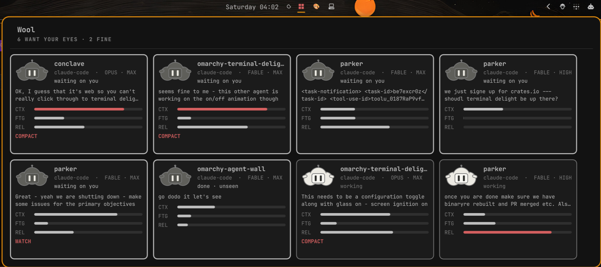

# Wool

**The whole flock on one wall.** An Omarchy bar plugin that shows every coding
agent on the machine as a card — a face whose colour says how it's doing, the
last prompt it was given, and its context vitals — with a click that takes you
to that agent's window.



Wool is the presence third of the shepherd family:

- **[Herd](https://github.com/parker-brown-family/herd)** is the *flock's
  state itself* — the local agent-state bus everything reads.
- **[Crook](https://github.com/parker-brown-family/omarchy-crook)** is
  *attention* — the shepherd's hook that singles out the one agent that needs
  you, from the bar.
- **Wool** is *presence* — the whole flock's coat, on a toggled wall.

They compose. None requires the others.

## Where the truth comes from

Wool draws; it detects nothing. All state comes from
**[Herd](https://github.com/parker-brown-family/herd)**, the local
agent-state bus, which publishes one file at
`~/.local/state/herd/state.json`:

- **Agents feed the herd.** Claude Code sessions self-report through hooks
  (`herd hook`); anything can `herd report`; `herd sync-herdr` mirrors in
  the agents that cannot speak for themselves.
- **Displays drink from it.** Wool, Crook, a tmux status line, a script
  blocking on `herd watch` — one writer, many readers.
- **Looking back is the one write.** Clicking a card focuses the agent's
  window and marks it `seen`, which is what turns *finished-and-unseen* into
  plain idle.

Vitals (context window · fatigue · relevance) are an optional enrichment from
`terminal-delight agent-vitals`, read only while the wall is open. No
terminal-delight installed → cards honestly show `— no vitals —`, never a
zero-length bar.

## The fleece doctrine

The face carries exactly three colours, readable from across the room:

| Fleece | Means | States |
|---|---|---|
| **white** | all good | working, idle |
| **dark grey** | wants your eyes | blocked (a question is waiting), done-and-unseen, unknown |
| **black** | broken | error |

*Unknown is grey by definition.* An entry whose `stale_after` has passed is
rendered unknown — a guess must never draw as calm. Fine-grained state lives
in the card's text, not the fleece.

The current face is an interim vector sheep-robot; the canonical sheep art is
authored in agent-playhouse and will replace it through the publish pipeline.

## Install

```bash
omarchy plugin add https://github.com/parker-brown-family/omarchy-agent-wool
```

Then add the **Wool** widget to your bar. For Claude sessions to appear, the
herd hooks must be installed (`cargo install herd-bus`, then `herd hooks` —
see the Herd repository); herdr agents appear whenever herdr is running.

Toggle the wall from a keybinding if you like:

```bash
qs ipc call brownfamilysports.wool toggle
```

## Settings

- **Hide when no agents are reported** (default on)
- **Wall refresh interval** (default 2500ms) — how often the *open* wall
  re-syncs herdr and re-reads vitals. Nothing at all is scanned while the
  wall is closed.

## What Wool deliberately is not

Terminal Delight's in-terminal Agent Wall binds *panes*: live buffer
thumbnails, text crawl, pane restyling. Wool binds *sessions* — the unit
visible from outside a terminal's render loop — so those stay Terminal
Delight's. Wool never writes to a PTY, never screenshots a buffer, and never
restyles anything. If you want the pane-level wall, that is the reason to run
Terminal Delight.

## Tests

```bash
sh tests/run.sh
```

Stub-driven: no herd, herdr, Hyprland or desktop session required.
